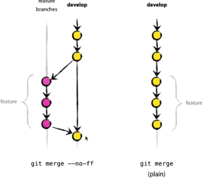

***Ветка (branch) в Git*** — это легко перемещаемый указатель на один из этих коммитов. Имя основной ветки по умолчанию в Git — master.

Когда вы делаете коммиты, то получаете основную ветку, указывающую на ваш последний коммит. Каждый коммит автоматически двигает этот указатель вперед.

Ветка и история коммитов:
 
 
 
### Создание новой ветки
***Просмотр веток:***
```
git branch
get branch -a
```
Что же на самом деле происходит, когда вы создаете ветку? Всего лишь создается новый указатель для дальнейшего перемещения. 
Допустим вы хотите создать новую ветку с именем “testing” Вы можете это сделать командой:
```
git branch testing
```
В результате создается новый указатель на тот же самый коммит, в котором вы находитесь. Две ветки указывают на одну и ту же последовательность коммитов.

Как Git определяет, в какой ветке вы находитесь? Он хранит специальный указатель HEAD. Имейте ввиду, что в Git концепция HEAD значительно отличается от других систем контроля версий, которые вы могли использовать раньше (Subversion или CVS). В Git это указатель на локальную ветку, в которой вы находитесь. В нашем случае мы все еще находимся в ветке “master”. Команда git branch только создает новую ветку. Переключения не происходит.


Вы можете легко это увидеть при помощи простой команды `git log`. Она покажет вам, куда указывают указатели веток. Эта опция называется `--decorate`.
```
git log --oneline --decorate
```

### Переключение веток
Чтобы переключиться на существующую ветку, выполните команду:
```
git checkout testing
```
После коммита в новой ветке, картина будет выглядеть следующим образом:


Посмотреть историю коммитов с указанием на ветки можно коммандой:
```
git log --oneline --decorate --graph --all
```

### Fast forward
Из-за того, что коммит, на который указывала ветка, которую вы слили, был прямым потомком того коммита, на котором вы находились, Git просто переместил указатель ветки вперед. Другими словами, если коммит сливается с тем, до которого можно добраться, двигаясь по истории прямо, Git упрощает слияние, просто перенося указатель метки вперед (так как нет разветвления в работе). Это называется `fast-forward` (перемотка). 

FF не создаёт мерж коммитов

До слияния с --ff


После слияния:


***Удаление ветки***
```
git branch -d hotfix
```
***Переименование ветки***
```
git checkout old_branch
git branch -m old_branch new_branch         # Rename branch locally    
git push origin :old_branch                 # Delete the old branch    
git push --set-upstream origin new_branch # Push the new branch, set local branch to track the new remote
```
### Слияние веток
Для слияния необходимо перейти в ветку, в которую будем сливать изменения и выполнить команду:
```
git checkout master
git merge develop
```
***Слить без fast forward:***
```
git merge --no-ff develop
```
Получится так:



